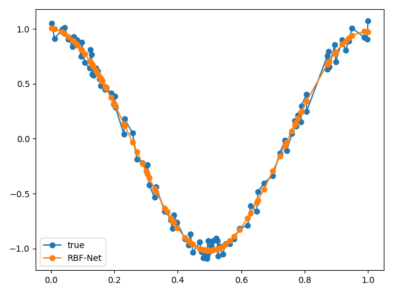

# Radial-Basis-Function-Network
A python implement of radial basis function network (RBFN), which can accept multi-variable input.
## The dependencies:
* python3
* scikit-learn
## Notes
  1. **How to specify the centers is the most difficult**. I specify the centers with clustering centers. ( So you can use any clustering algorithm to get the centers. ). Now, you can specify the number of centers as whatever you want.
  2. **The scale length of each radial basis function can be different.** But I set the scale length of each radial basis function with same value.
## Test

## Reference
* [Broomhead, D.S. and Lowe, D., 1988. Radial basis functions, multi-variable functional interpolation and adaptive networks (No. RSRE-MEMO-4148). Royal Signals and Radar Establishment Malvern (United Kingdom).](https://pdfs.semanticscholar.org/b08b/a914037af6d88d16e2657a65cd9dc5cf5da1.pdf)
